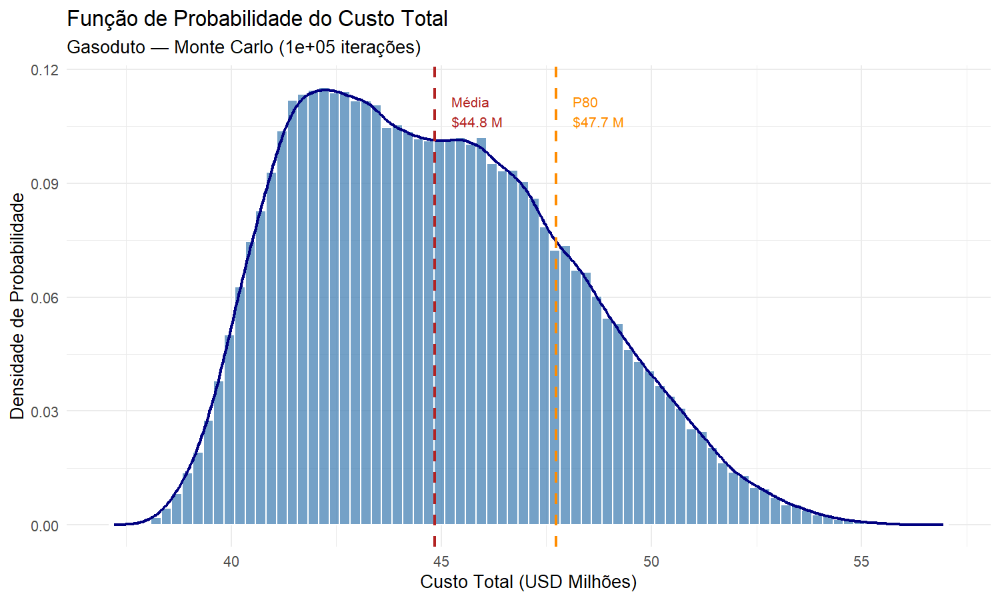
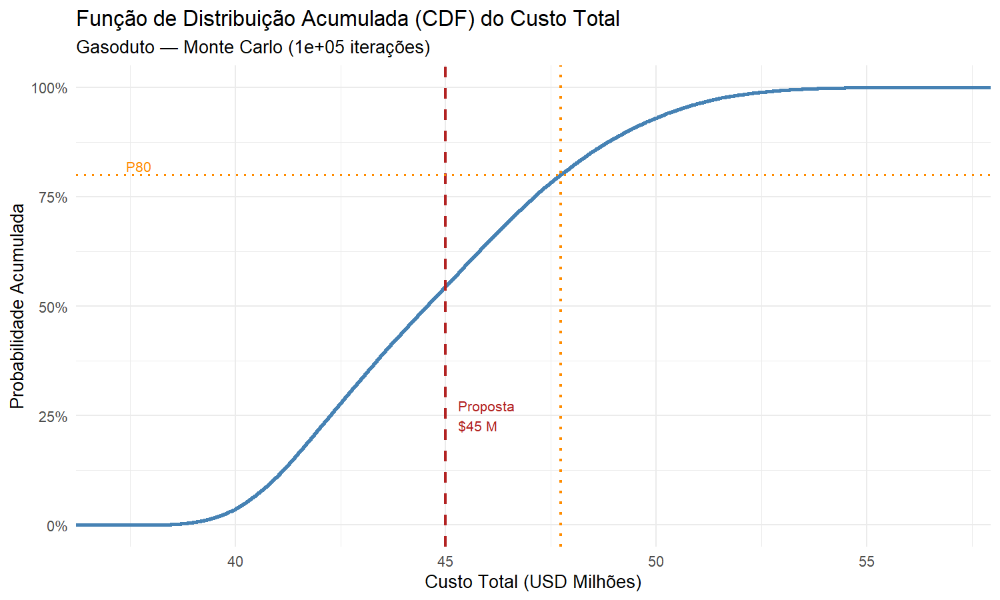
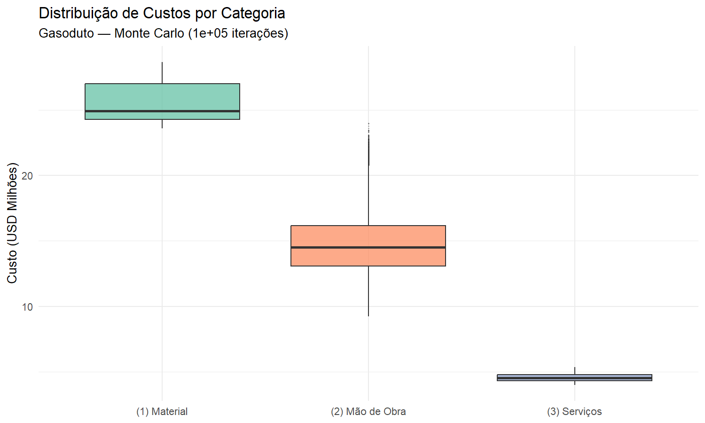

# Modelo de Risco — Custo de Projeto de Gasoduto

Simulação Monte Carlo em R para estimativa do custo total de construção de um gasoduto, desenvolvida como resposta à Lista 02 da disciplina de Análise de Risco (UFRJ).

---

## Problema

A rota preferida do gasoduto tem **260 km** de extensão. Existe, porém, o risco de que, devido a oposição local, uma rota alternativa de **290 km** tenha que ser utilizada. A probabilidade desse evento é ela mesma incerta, estimada entre **35% e 45%**.

Todos os itens de custo são modelados por **distribuições triangulares** (mínimo, moda, máximo).

### Itens de custo

| Categoria | Item | Mín | Moda | Máx | Unidade |
|---|---|---|---|---|---|
| Material | Tubulação | 725 | 740 | 790 | $/seção (8m) |
| Mão de obra | Tempo para cavar vala | 12 | 16 | 25 | hh/seção (8m) |
| Mão de obra | Custo de mão de obra | 17 | 18,5 | 23 | $/hora |
| Mão de obra | Tempo de soldagem | 4 | 4,5 | 5 | horas/junção |
| Serviços | Transporte da tubulação | 6,1 | 6,6 | 7,4 | $/seção (8m) |
| Serviços | Sistema de filtragem | 165.000 | 173.000 | 188.000 | $ (fixo) |
| Serviços | Acabamento | 14.000 | 15.000 | 17.000 | $/km |

---

## Estrutura do código

```
gasoduto_risco.R
├── Seção 0 — Pacotes necessários
├── Seção 1 — Constantes do problema (especificação)
├── Seção 2 — Parâmetros de simulação
├── Seção 3 — Funções auxiliares (rtriangular)
├── Seção 4 — Simulação Monte Carlo
│   ├── 4.1  Definição da rota
│   ├── 4.2  Geometria (nº de seções e junções)
│   ├── 4.3  Amostragem dos itens de custo
│   └── 4.4  Cálculo por categoria
└── Seção 5 — Resultados e visualizações
    ├── 5.1  Estatísticas do custo total
    ├── 5.2  Breakdown por categoria
    ├── 5.3  Perspectiva do proponente
    └── 5.4  Perspectiva do contratante
```

As constantes da especificação ficam **isoladas na Seção 1** — qualquer alteração de escopo deve ocorrer apenas ali.

---

## Como executar

### Pré-requisitos

- R ≥ 4.0
- Pacotes: `ggplot2`, `scales`

```r
install.packages(c("ggplot2", "scales"))
```

### Execução

```r
source("gasoduto_risco.R")
```

Os gráficos são salvos automaticamente como PNG na mesma pasta do script.

---

## Resultados

### Distribuição do custo total (100.000 iterações)

| Percentil | Custo (USD) |
|---|---|
| Mínimo | $ 37,2 M |
| P10 | $ 40,9 M |
| P25 | $ 42,3 M |
| Média | **$ 44,8 M** |
| Mediana | $ 44,6 M |
| P75 | $ 47,1 M |
| P80 | **$ 47,7 M** |
| P90 | $ 49,3 M |
| Máximo | $ 57,0 M |
| Desvio Padrão | $ 3,2 M |

### Custo médio por categoria

| Categoria | Custo médio | Participação |
|---|---|---|
| (1) Material | $ 25,6 M | 57,0% |
| (2) Mão de obra | $ 14,7 M | 32,8% |
| (3) Serviços | $ 4,6 M | 10,2% |
| **Total** | **$ 44,8 M** | 100% |

### Questão 2 — Perspectiva do proponente

Adotando o **P80** como preço proposto (80% de chance de não ter prejuízo):

- **Preço proposto:** $ 47,7 M
- **Contingência (P80 − Média):** $ 2,9 M (~6,4%)

### Questão 3 — Perspectiva do contratante (proposta de $45 M)

- P(custo ≤ $45 M) = **54,6%**
- P(custo > $45 M) = **45,4%**
- **Recomendação: REJEITAR** — probabilidade de prejuízo elevada (>20%)

---

## Gráficos gerados

| Arquivo | Descrição |
|---|---|
| `grafico1_PDF.png` | Função de probabilidade (histograma + densidade) |
| `grafico2_CDF.png` | Função de distribuição acumulada com linha dos $45 M |
| `grafico3_boxplot.png` | Distribuição de custos por categoria |

### PDF — Função de Probabilidade


### CDF — Função Acumulada


### Boxplot por Categoria

